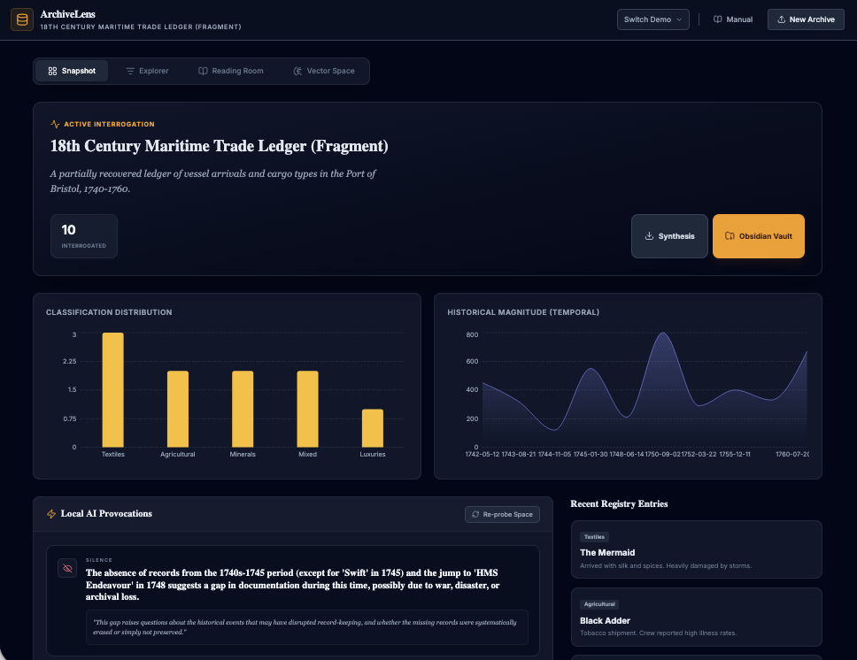
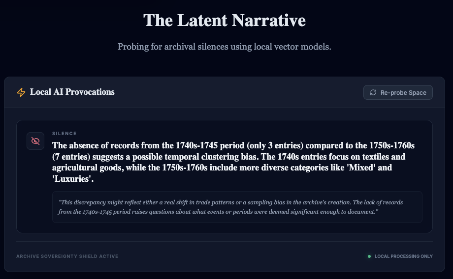

## Run Locally

**Prerequisites:**  Node.js

1. Install dependencies:
   `npm install`
2. Install Ollama. Pull an ollama model you want to use. Change the line in the ollama services file that passes the model name. Save!
3. Run the app:
   `npm run dev`

The idea is that this web app lets you work on a csv of your humanities data, generate a couple of useful distant views on it, export it all into an obsidian vault for further writing around your data. The local llm stuff is just an experiment to see if it can offer useful provocations or perspectives on the data. The local llm looks for silences, ellisions, or things that seem orthoganal to the rest of the collection. See the ollama services file for the prompt. 

And of course, running this with a local model preserves the privacy of the data. If however you should wish to use a commercial provider, there is a gemini service file that you can use, and if this applies to you I'll assume you know enough how to invoke etc.

Another view of the provocation tab:

